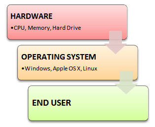
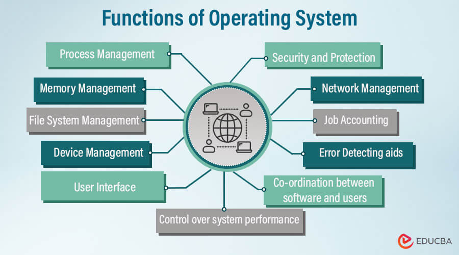
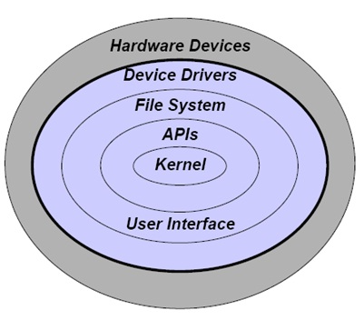
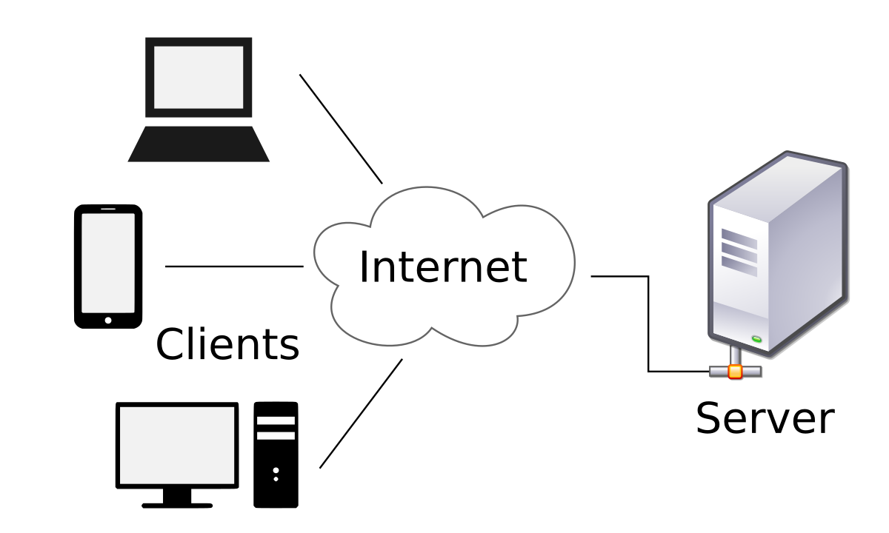
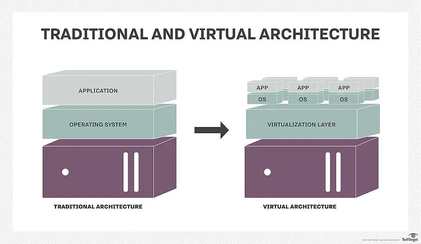
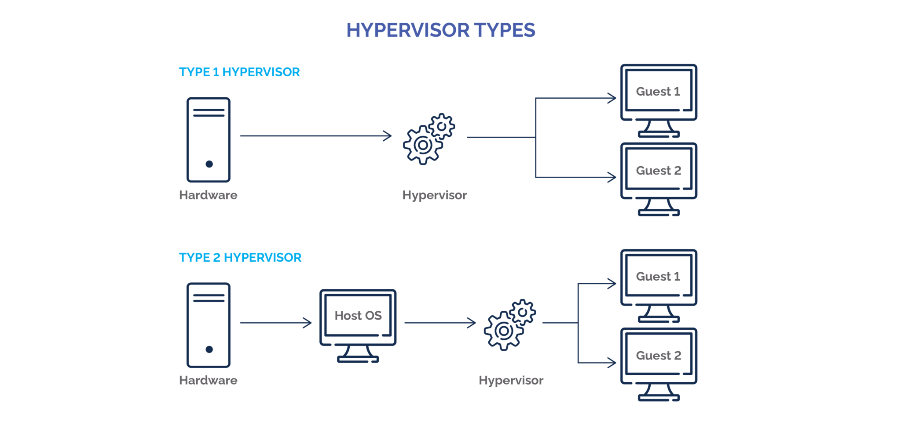

# INTRODUCTION TO OPERATING SYSTEMS, VIRTUALIZATION AND VIRTUAL MACHINES

## OPERATING SYSTEMS
### What is an Operating System?
An Operating System acts as a communication channel (interface) between the user and computer hardware. The purpose of an operating system is to provide a platform on which a user can execute programs conveniently and efficiently. An operating system is a piece of software that manages the allocation of Computer Hardware. The coordination of the hardware must be appropriate to ensure the correct working of the computer system and to prevent user programs from interfering with the proper working of the system. 

 ### Tasks of an Operating System
Tasks of an Operating system include the following - 
1. Memory management - allocation and deallocation of memory to various processes and ensures that the other process does not consume the memory allocated to one process

2. Processor management - allocates and deallocates processors to processes and decides the order in which processes have access to the processor, and how much processing time each process has

3. I/O Device management - manages device communication via its respective drivers by receiving the requests from these devices to perform a specific task, and communicates back to the requesting process

4. File management - keeps track of where information is stored and information regarding the creation, deletion, transfer, copy of the files, user access settings, the status of every file and storage of files in an organized way. 

5. Security - uses password protection to protect user data and similar other techniques. it also prevents unauthorized access to programs and user data.

6. Network management - help computers talk to each other and the internet and manage how data is packaged and sent over the network, making sure it arrives safely and in the right order. It ensures your computer is using the network efficiently and securely, like adjusting the speed of your internet or protecting your computer from online threat

7. Secondary-Storage Management: Systems have several levels of storage which includes primary storage, secondary storage, and cache storage. Instructions and data must be stored in primary storage or cache so that a running program can reference it. 

8. Command interpretation: This module is interpreting commands given by the and acting system resources to process that commands.

9. Communication management: Coordination and assignment of compilers, interpreters, and another software resource of the various users of the computer systems.

 ### Components of an Operating System
The components of an operating system can be broken down into four main parts namely

*Kernel* - this has the task of loading the applications into memory, making sure they do not interfere with one another and allowing them to share use of the CPU efficiently. The kernel also handles file storage to and from secondary storage devices such as hard disks and optical drives.

*Device Drivers* - Every piece of hardware that makes up the computer or connected to it, will have a device driver that allows the operating system to control and communicate with it. There could be hundreds of device drivers pre-installed with the operating system, and the right ones for that particular computer set-up is loaded on boot-up.

*User interface* - This part of the operating system directs what is seen on the screen (via the device driver) and reacting to key presses and other inputs. The user interface could be a basic command line interface, as you might find on a server, or it might be a full blown Graphical User Interface (GUI) such as the Mac OS X, Windows or perhaps Gnome on Linux.

*System Utilities* - This part of the operating system provides all the basic facilities that run in the background without user interaction. For example Print spool services, Cryptographic password management, File management services. 

### Types of Operating Systems
Types of Operating System include the following 

1. Batch Operating System
Some computer processes are very lengthy and time-consuming. To speed the same process, a job with a similar type of needs are batched together and run as a group. The user of a batch operating system never directly interacts with the computer. In this type of OS, every user prepares his or her job on an offline device like a punch card and submit it to the computer operator.

2. Multi-Tasking/Time-sharing Operating systems
Time-sharing operating system enables people located at a different terminal(shell) to use a single computer system at the same time. The processor time (CPU) which is shared among multiple users is termed as time sharing.

3. Real time OS
A real time operating system time interval to process and respond to inputs is very small. Examples: Military Software Systems, Space Software Systems are the Real time OS example.

4. Distributed Operating System
Distributed systems use many processors located in different machines to provide very fast computation to its users.

5. Network Operating System
Network Operating System runs on a server. It provides the capability to serve to manage data, user, groups, security, application, and other networking functions.

6. Mobile OS
Mobile operating systems are those OS which is especially that are designed to power smartphones, tablets, and wearables devices. Some most famous mobile operating systems are Android and iOS, but others include BlackBerry, Web, and watchOS.

### Linux Operating System
The Linux OS was created in 1991 by Linus Torvalds while studying at the University of Helsinki. Linux was originally designed as a free, robust, and open-source alternative to Minix. Minix was another Unix clone that was effectively used in academic settings. It has become one of the most popular and versatile OS in the world with many distributions such as Red hat and Ubuntu for many different use cases. The Linux operating system is used in a wide variety of systems and environments. It powers large cloud infrastructure environments, on-premises converged infrastructure appliances, application servers, desktop computing environments, and embedded systems. Some distributions of Linux software also include a hypervisor for hosting virtual machines.

## VIRTUALIZATION AND VIRTUAL MACHINES
### What is a Server?
A server is a computer or system that provides resources, data, services, or programs to other computers, known as clients, over a network. In theory, whenever computers share resources with client machines they are considered servers. 

 ### The concept of Virtualization
Virtualization is the creation of a virtual (rather than actual) version of something, such as an operating system (OS), a server, a storage device or network resources. Virtualization uses software that simulates hardware functionality to create a virtual system. This practice allows IT organizations to operate multiple operating systems, more than one virtual system and various applications on a single server. The benefits of virtualization include greater efficiencies and economies of scale. OS virtualization is the use of software to allow a piece of hardware to run multiple operating system images at the same time. 

### What is a Virtual Machine?
A virtual machine (VM) is an application that functions as a virtual computer but resides within a physical computer (e.g., a host computer). Often referred to as guest machines, virtual machines work as separate independent machines but run as a process on the host machine's operating system. However, both the physical computer and the virtual machine believe they are each interacting with a separate physical machine. This is important because it keeps the host and guest machines from cannibalizing the other's resources, as well as enabling the use of guest operating systems by the VMs as they focus on specific tasks which are separate from the physical machine's functions.

### What is a hypervisor?
A hypervisor is software that creates and runs virtual machines (VMs), which are software emulations of a computing hardware environment. Sometimes called a virtual machine monitor (VMM), the hypervisor isolates the operating system and computing resources from the virtual machines and enables the creation and management of those VMs. Hypervisors also make server virtualization possible by allowing different operating systems to run separate applications on a single server while still using the same physical hardware resources.

### Physical Machine vs Virtual Machine
Virtual machines are easier to manage and are time and cost effective consuming less physical space than actual physical machines. Virtual machines also allow other operating systems to run on the physical machine which is different from the operating system on the physical machine for example a virtual machine can run a distribution of Linux OS such as Ubuntu on a physical machine running a Windows OS. However, Virtual machines are less efficient and run slower than a full physical computer. Most enterprises use a combination of physical and virtual infrastructure to balance the corresponding advantages and disadvantages. 